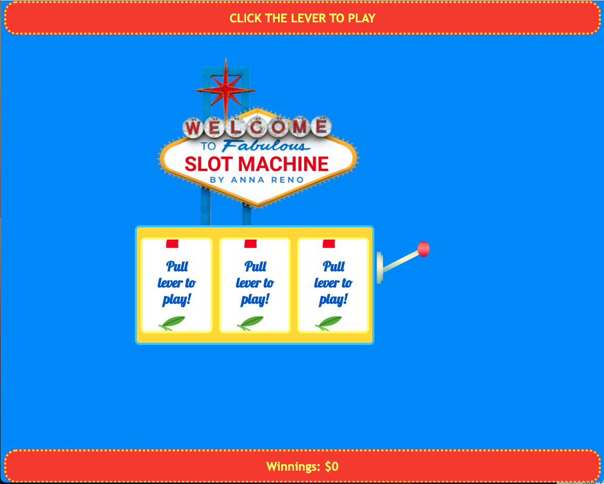
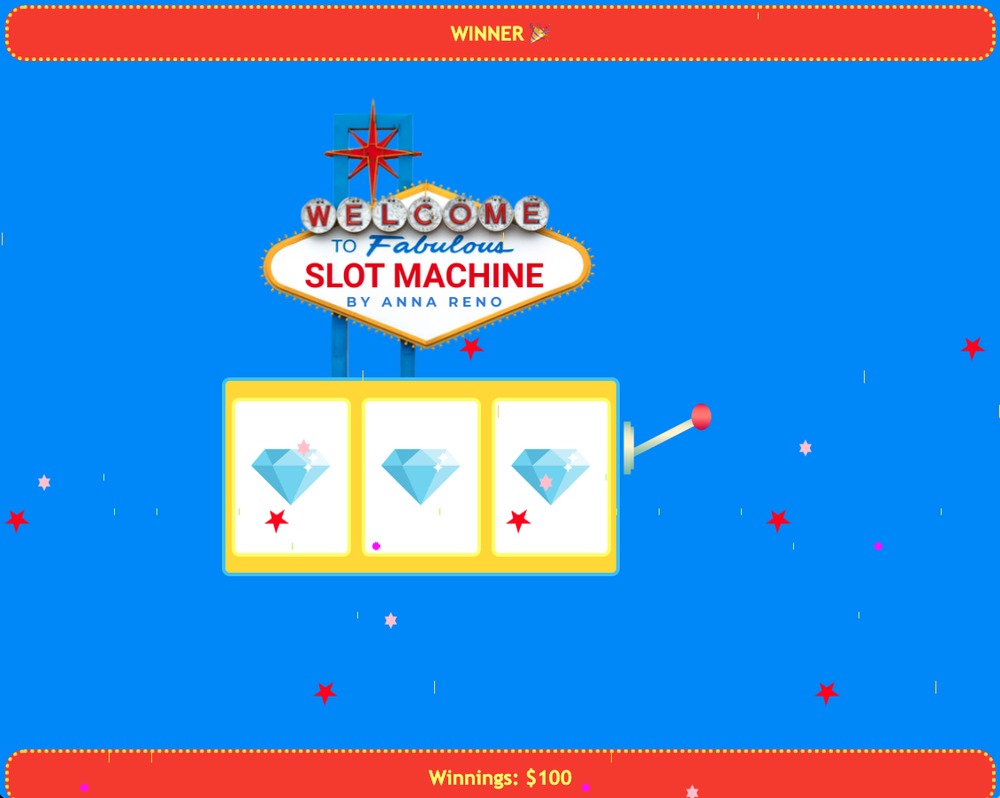
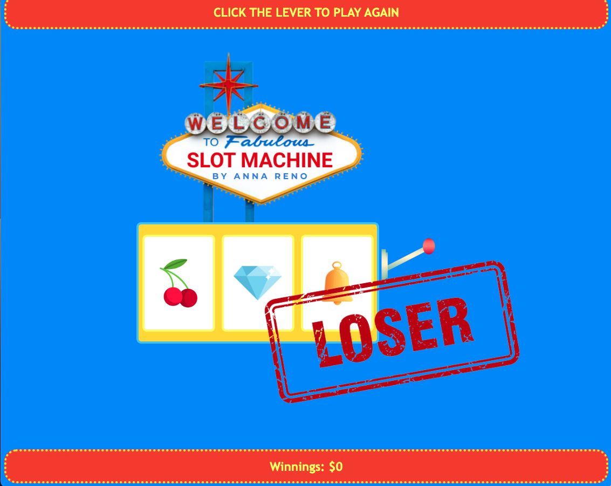

# project1
HTML/CSS/JS browser based game

Slot Machine: Click the lever to spin the slots. If all three slots land on the same icon, you win! If the icons don't match, you lose. Each win adds $100 to your total winnings.

Screenshots of game:

Technologies Used: JavaScript, HTML, CSS.

Getting Started: 
    - https://annakreno.github.io/slotmachinegame/ 
    - Click the lever to spin the slots.

Next Steps: 
    - Add a "bomb" jackpot that results in losing all winnings
    - Set different prize amounts for different icon jackpots.
    - Look into random number generator, doesn't seem to land on jackpot the statistically expected number of times, lowered the options to return so that it'd land on jackpot more easily for demo purposees.
    - Smooth the transition between spinning slot and the landed upon icon.
